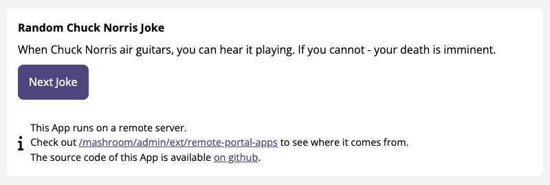

# Mashroom Demo Remote Portal App

Demo App (SPA) for [Mashroom Server](https://www.mashroom-server.com) that shows a random Chuck Norris joke from
[http://api.icndb.com](http://api.icndb.com).
This App comes with its own server and *BFF* (Backend For Frontend) and can be integrated as a *Remote App*
into *Mashroom Portal*.

It also runs on [http://demo-remote-app.mashroom-server.com](http://demo-remote-app.mashroom-server.com)
if you want to test the Remote App capabilities of *Mashroom Portal* without installing this first.

## Usage

    npm install
    npm run dev

Open in your browser: http://localhost:6088/

### Integrate it into the Mashroom Portal

 * Clone, setup and start the [Mashroom Portal Quickstart](https://github.com/nonblocking/mashroom-portal-quickstart) project
 * Open http://localhost:5050/mashroom/admin/ext/remote-portal-apps
 * Copy http://localhost:6088 into the URL input and click _Add_
 * Open http://localhost:5050/portal and place the _Mashroom Demo Remote Portal App_ on any page via Drag'n'Drop

### Docker

    npm install
    npm run build
    docker build -t mashroom-demo-remote-portal-app .
    docker run --rm -p 6088:6088 mashroom-demo-remote-portal-app

